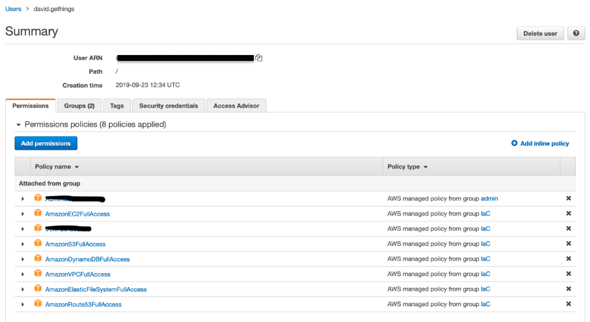

# 1. IAM User Permissions

Validate that you IAM user has the following highlighted permissions

---

[Back To List](./d100.building.md)

[NEXT: >>>    (2. Create an AWS Hosted DNS Zone)](./d102.DNS-zone.md)
