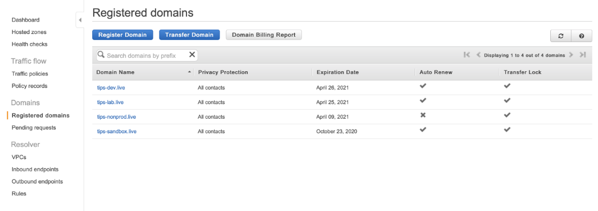
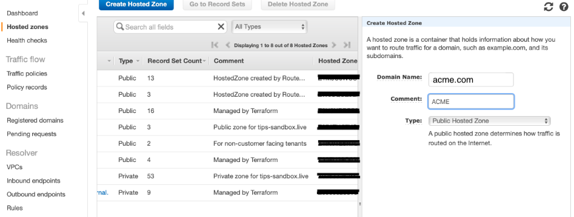

# 2. Create an AWS Hosted DNS Zone (Route53)

- Login to the console and select the Route53 service
- If necessary Register the domain name requested:
  - Go to `Registered domains` and click on `Register Domain`.  
   

- Setup the zone
  - Go to `Hosted zones` and click on `Create Hosted Zone`
  
  - Click on `Create Hosted Zone` and complete the form that is displayed
  
  - Keep the Type as `“Public Hosted Zone”`.
  - Click `Create`

---

[Back To List](./d100.building.md)

[NEXT: >>>    (3. Create a local workspace)](./d103.local-workspace.md)
