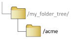

# 3. Create a Local Workspace

It is important to create a dedicated local workspace for each Tennant, as the file paths and structure will directly relate to the deployment.

Failure to follow the directory structure instructions throughout this doc WILL result in deployment issues later in the process - and the whole document may need to be repeated-from-scratch.

```bash
$ mkdir acme
$ cd acme
$
```



You should now have the folder structure illustrated here.

---

[Back To List](./d100.building.md)

[NEXT: >>>    (4. Clone the 'Backend' repo)](./d104.backend-repo.md)
