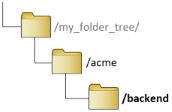

# 4. Clone the AWS-Backend repo

The code in this GitHub repository quickly and consistently sets up a Terraform State Store in the Tennants AWS account, in the selected region.  Enter the following command to clone the repository from GitHub to a local folder called “bootstrap”:

```bash
$ git clone git@github.com:mojoaloop/iac-aws-backend.git backend
Cloning into 'iac-aws-backend'...
remote: Enumerating objects: 15, done.
remote: Counting objects: 100% (15/15), done.
remote: Compressing objects: 100% (12/12), done.
remote: Total 15 (delta 3), reused 11 (delta 2), pack-reused 0
Receiving objects: 100% (15/15), 8.82 KiB | 8.82 MiB/s, done.
Resolving deltas: 100% (3/3), done.
$
```



Your folder structure should have been updated as illustrated here.

---

[Back To List](./d100.building.md)

[NEXT: >>>    (5. Setting up AWS credentials)](./d105.aws-credentials.md)
