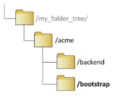

# 8. Create the boostrap
 --- add refrence to correct main.tf sample file ??
 
Move from the “backend” directory back into the “acme” directory. Create a bootstrap directory:

```bash
cd ..   # to acme dir
mkdir bootstrap
```

 This should result in the folder structure illustrated here.

Using the editor software of preference (vim is generally used in this document, but nano, vsCode, blueFish etc are all perfectly acceptable) create `bootstrap/main.tf` using the example at <https://github.com/modjaloop/iac-aws-bootstrap/blob/master/examples/acme/main.tf>

---

[Back To List](./d100.building.md)

[NEXT: >>>    (9.  Initialise bootstrap terraform)](./d109.init-bootstrap.md)
