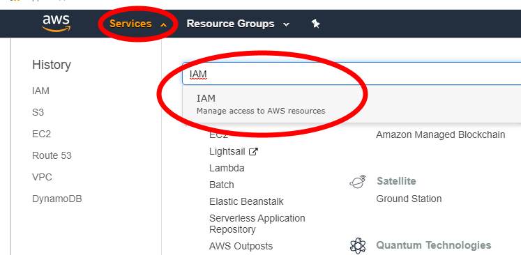
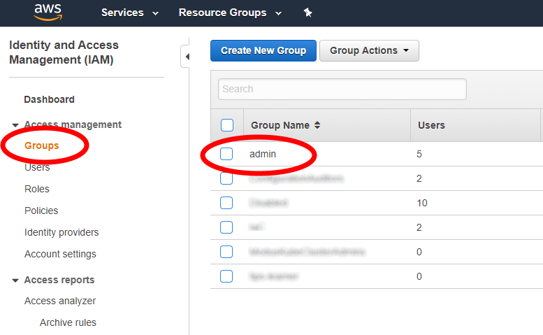
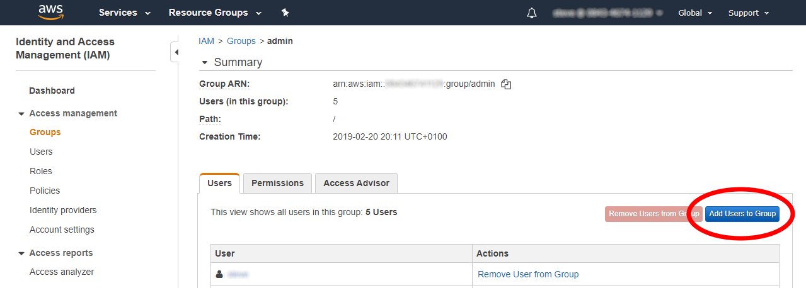
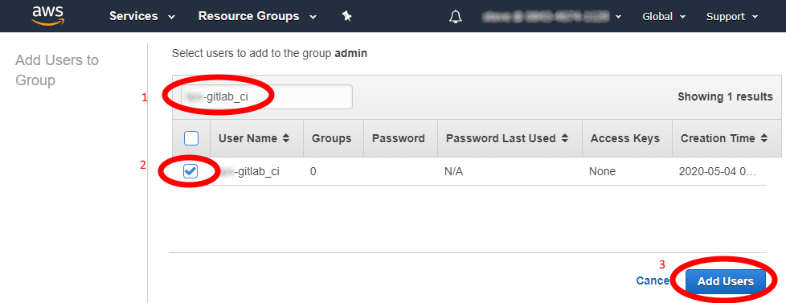

# 13.  Manually configure the GitLab CI-runner AWS account - This part is automated and not need to do manually

>The intent for subsequent releases of mojaloop-bootstrap is to apply more granular permissions to the gitlab_ci IAM user to restrict it to it’s specific tenant, however at the time of writing the need for customers to have functioning labs in a dedicated AWS account outweighs the need for allowing AWS accounts to be shared between tenants.   Storing Administrative AWS Credentials in GitLab for a production environment is **NOT** a reccomended practice!

## Configuraing the GitLab CI-Runner AWS account

1. Login to the AWS console using your administrative privileges.
2. Browse to Services\IAM\
    
3. Select the “Groups” page, and click on the “admin” group (not the checkbox) to open it:
    
4. From the admin group page, Click the “Add Users to Groups” button:
    
5. From the “Add Users” page, enter the tenant\customer name, followed by the -gitlab_ci (for example citigroup-gitlab_ci).   The requested IAM account should appear in the list - select the checkbox next to it, and press “Add Users to Group”
    

This enables the account to administer the AWS instance. As this account will be used by the gitlab_ci runner, we now need to provide a way for this gitlab to authenticate to the account.

---

[Back To List](./d100.building.md)

[NEXT: >>>    (14. Configuring Authentication)](./d114.config-auth.md)
