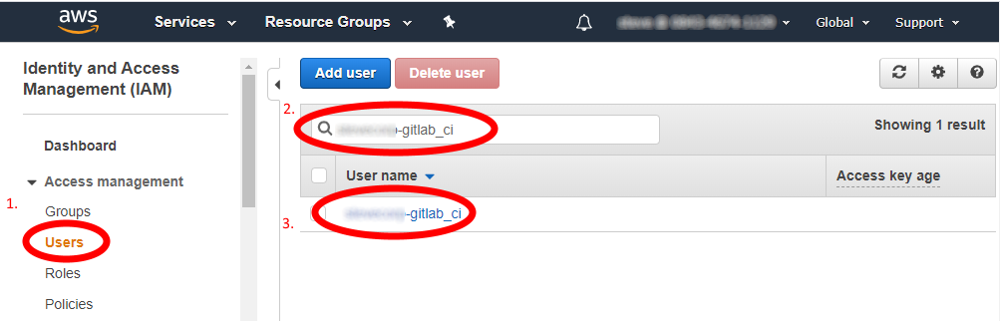
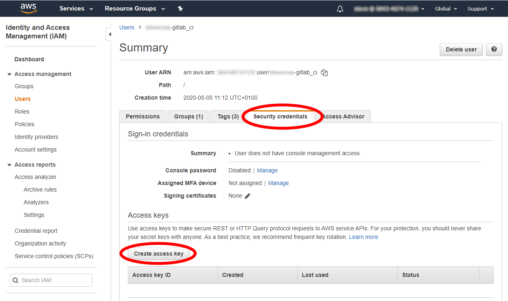
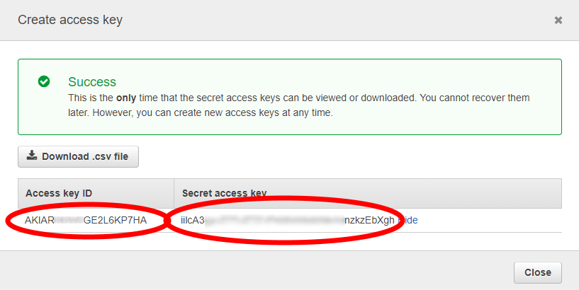

# 14. Configuring Authentication

1. If you aren’t already - Login to the AWS console using your administrative privileges.
2. Browse to `Services\IAM\`  as before.
3. Select `“Users”` and enter the name of the gitlab_ci account  in the form `%tenantname%-gitlab_ci` (for example `citigroup-gitlab_ci`) and when the acount appears in the list, click it’s name (**NOT** the checkbox)
  
4. Once the account summary is displayed, select the “Security Credentials” page, and “Create Access Key”:
  

  > Record both the access key ID and the Secret Access key and keep them safe - ideally in some kind of Password manager like 1Password or LastPass (or any other such application)
  
5. 

You now have an access key for an administrative account

---

[Back To List](./d100.building.md)

[NEXT: >>>    (15. Setup Gitlab)](./d115.setup-gitlab.md)
