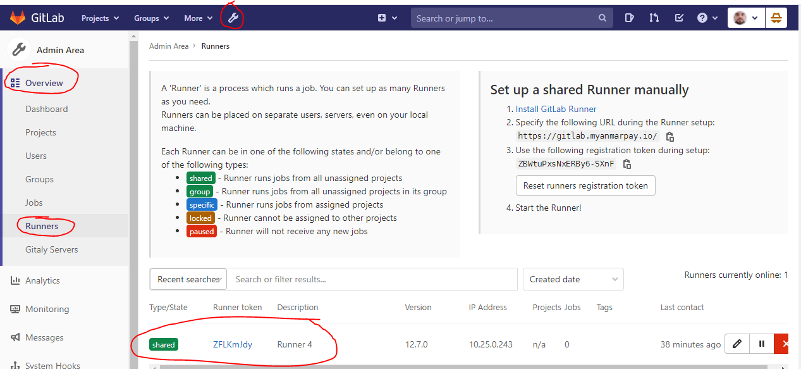

# 16. Check the CI_Runner

Browse to the "Admin Area", Overview, Runners, and confirm the existance of a GitLab CI-runner:

Should a runner not appear, follow the manual configuration guide [here](./d98.ci_runner.md)

---

[Back To List](./d100.building.md)

[NEXT: >>>    (17. Push Bootstrap to GitLab)](./d117.push-bootstrap.md)