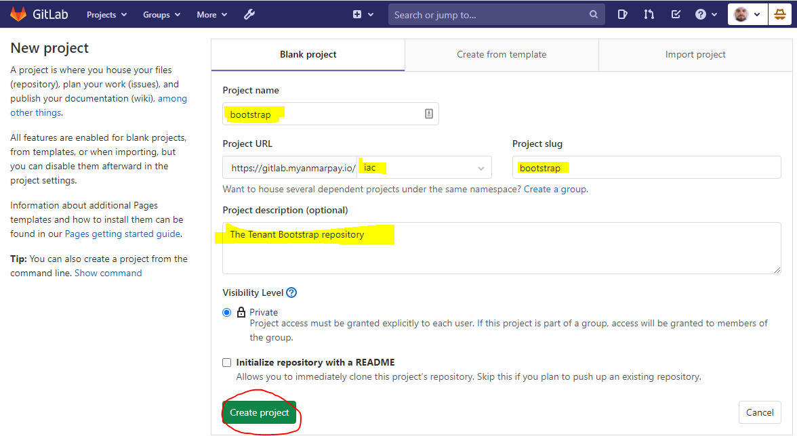
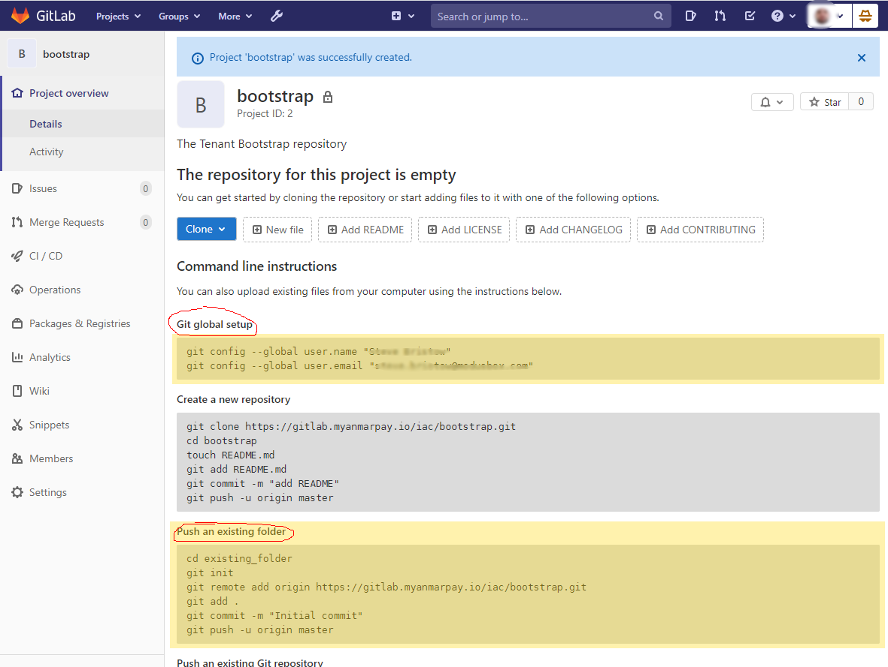
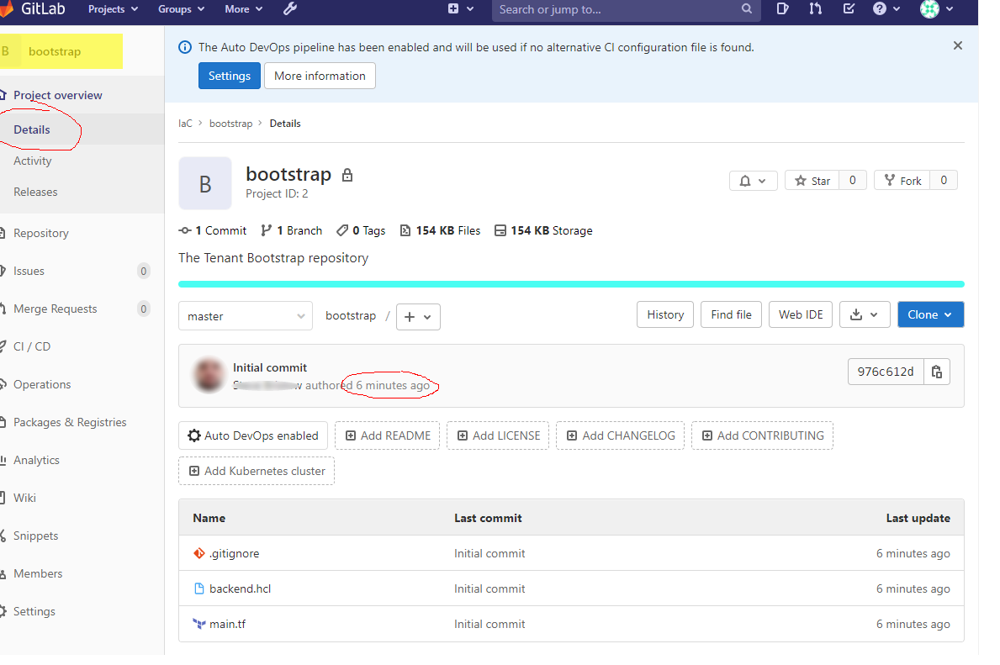

# 17. Pushing boostrap to GitLab

When creating bootstrap, the backend.hcl file should have been copied from `.\backend\backend.hcl` to `.\bootstrap\backend.hcl`.

> IMPORTANT: Verify the existance of `.\bootstrap\backend.hcl` before continuing.

Now that the tenant state is configured in AWS, the `\backend\` folder is no longer neccessary.  Additional environments can be added without re-running the "backend-builder".

The `\bootstrap\` folder contains the described template configuration for each environment within the tenant.
This folder must be pushed to GitLab to allow other engineers to add extra IaC environments, a process which requires bootstrap to be re-run.

From the GitLab server web interface, browse to the "Groups" dropdown and select the IaC project:
  

Select the "New Project" button:
  

Populate the "New Project" form as below:
  
Press the "Create Project Button.

Follow the onscreen instructions - if you haven't already configured your local Git user, do so here as shown.

From the command line, ensure you are in `./bootstrap/`.  This is the `existing_folder` referred to in the instructions.

Prior to executing the instructions run the following command inside the bootstrap folder:
```bash
$ echo .terraform >> .gitignore
```

This command will prevent various emphemeral terraform components from being ingested into GitLab.

Once complete, the "Push an existing folder" instructions can be followed.

>Remember, `./bootstrap/` is the `existing_folder`

  

Verify that the bootstrap has been successfully pushed to GitLab:

  

  
---

## This concludes the steps for creation of a Tenant, ready for deploying environments

[Back To List](./d100.building.md)
