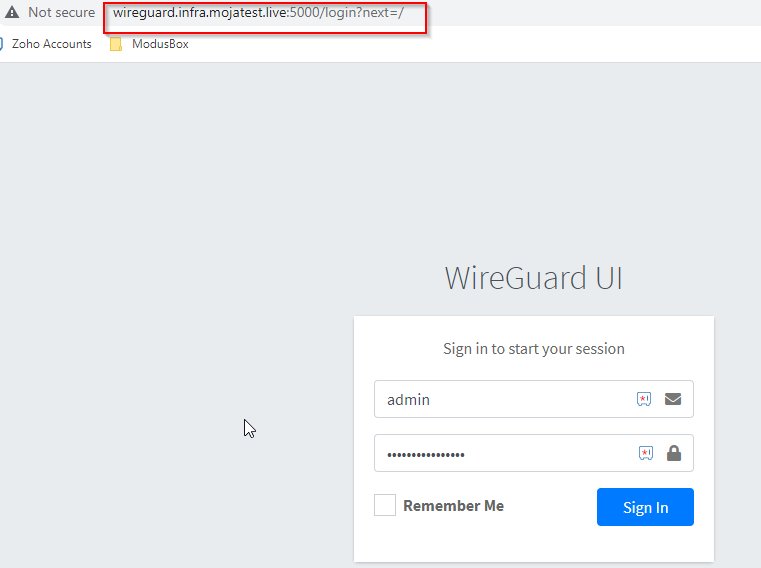
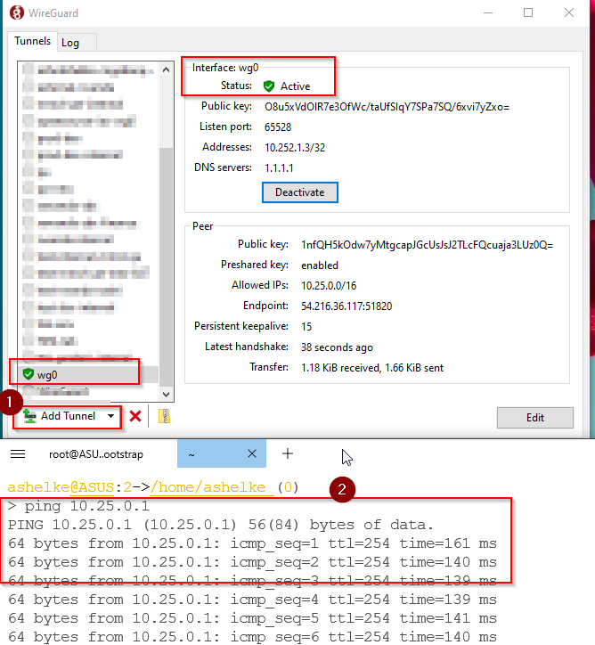
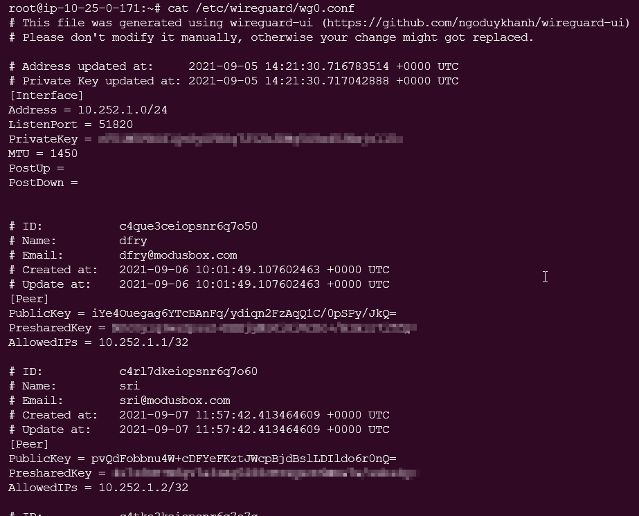
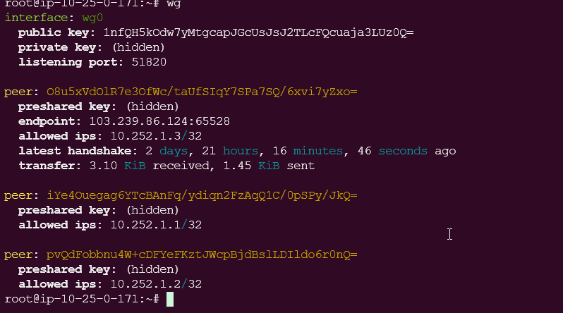

# Adding Accounts to the VPN

This document explains how to use the VPN solution to access Mojaloop environments and how to create profiles and user accounts.

## Get wireguard Console

```bash
# terraform output wireguard_vpn_hostname
"wireguard.infra.mojatest.live"

Get admin password
# terraform output wireguard_ui_admin_pw
"xxxxxxxxx"
```
Form URL :- http://<wireguard_vpn_hostname>:5000

URL :- http://wireguard.infra.mojatest.live:5000

Username:- admin

Password:- xxxxxxx

## Login to Wireguard UI




## Managing Wireguard 'Accounts' (connections)

Create new user profile. (Follow 8 step process)


### How user can connect to a VPN connection, follow these steps

1. The requester can choose  "Add Empty Tunnel"  or "Import Tunnels from file" option from Wireguard application as the following screenshot:
    
2. Afterwards that the requester should see Status Active for the created tunnel

To test the VPN, ping the default gateway for the VPN server subnet - `ping 10.25.0.1`




3. Login to wireguard server to verify the status or admin/ops tasks (optional)

1. Get wireguard hostname or public ip

   ``` bash
   # terraform output wireguard_vpn_hostname
   "wireguard.infra.mojatest.live"
   OR
   # terraform output wireguard_public_ip
   "xx.xx.xx.xx"
   ```

2. Get the wireguard server ssh private key, save to a file and set the permissions so ssh is happy

   ```bash
   # terraform output wireguard_private_key > ssh_keys/wireguard
   chmod 0600 ssh_keys/wireguard
   ```

3. Now you can ssh the wireguard server to add profiles (i.e. access accounts) or other admin/ops tasks

   ```bash
   # you can login using hostname or public ip
   ssh -i ssh_keys/wireguard ubuntu@<wireguard_vpn_hostname>
   or 
   ssh -i ssh_keys/wireguard ubuntu@<wireguard_public_ip>
   ```

Login to the wireguard server. The wireguard server config is stored in the `/etc/wireguard/wg0.conf` file. There you will find the server settings as well as information regarding the authorized peers. Each `[Peer]` entry represents a single user that can access the server.



The "`wg`" tool can be used to identify the public key of the WireGuard server. This tool is also useful for identifying whether a connection has been successful at a key-exchange level, and confirming that `wg0.conf` `peer-id` matches the clients `public-key`.

```bash
ubuntu@wireguard:~$ sudo wg0
```




---

[Back To List](./d100.building.md)

[NEXT: >>>    (13. Configuraing the GitLab CI-Runner AWS account)](./d113.ci-runner-creds.md)
