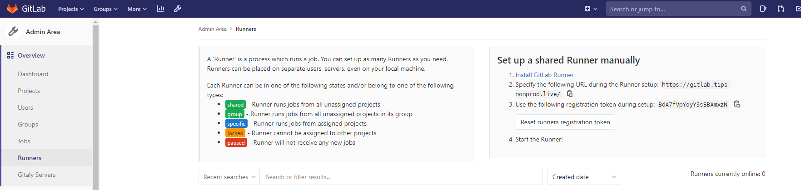

# Manually Coniguring a GitLab CI-Runner

>This manual step should no longer be required in bootstrap 0.6.0 or higher.

Browse to the GitLab CICD settings, CI Runners page:


1. Get the URL and Key.
2. From the AWS console, get the IP address of the CI-runner.
3. Execute the following commands:

  ```bash
  ssh -i  ./.terraform/modules/bootstrap/modules/gitlab/ssh_keys/<tennant>-gitlab ubuntu@<IPAddress>
  sudo gitlab-runner register
  ```

  You will be prompted with the following questions:

  ```bash
  Please enter the gitlab-ci coordinator URL (e.g. https://gitlab.com )
  ```

  _Enter the URL obtained from the GitLab registration page_

  ```bash
  Please enter the gitlab-ci token for this runner 
  ```

  _Enter the key obtained from the GitLab registration page_

  ```bash
  Please enter the gitlab-ci description for this runner 
  ```

  _Enter `gitlab_ci`_

  ```bash
  Please enter the gitlab-ci tags for this runner (comma separated): 
  ```

  _No tags are required.  Simply press Enter._

  ```bash
    Please enter the executor: ssh, docker+machine, docker-ssh+machine, kubernetes, docker, parallels, virtualbox, docker-ssh, shell: 
  ```

  _Enter `docker`._

  ```bash
    Please enter the Docker image (eg. ruby:2.6):  
  ```

  _Enter `alpine:latest`_
